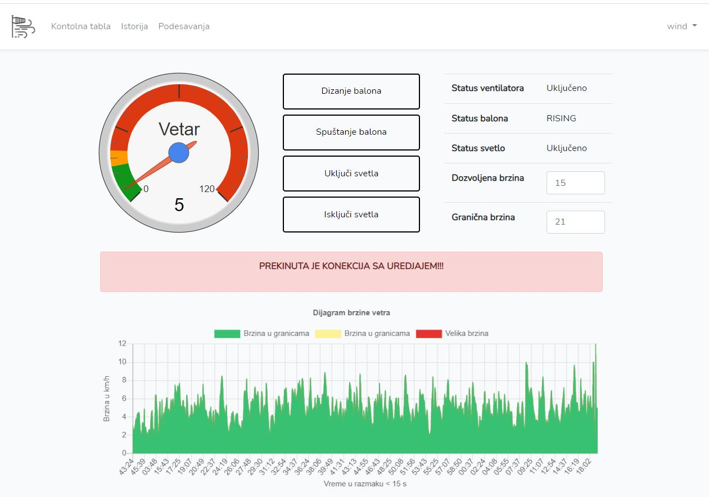
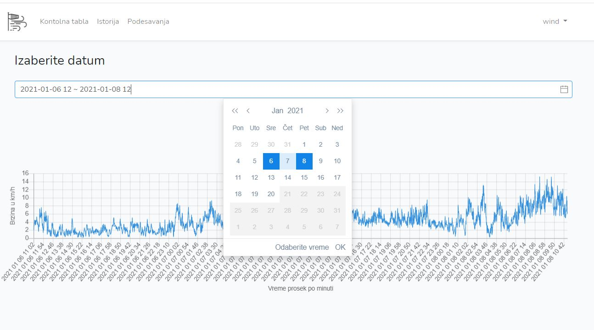
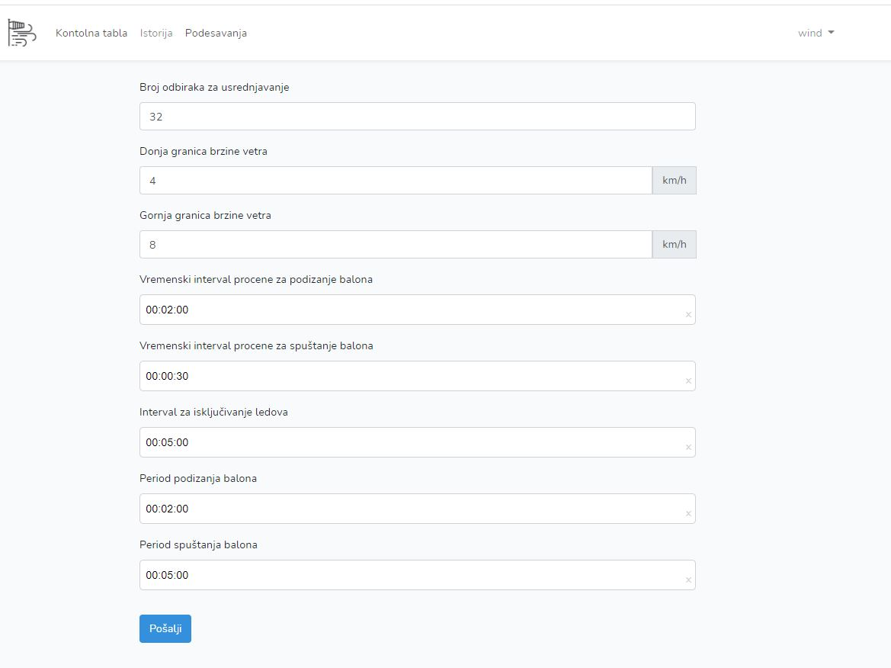

</a>

</a>

</a>

## About Wind app

This app was used for wid speed measuring.
On the root of the folder you can find "Vetar" file that contains SQL for this app.
You could use my passwords for authoritarian or create your own in SQL file:
-admin: mail        :mail.koji.ne.koristim@gmail.com
        password    :Wind878264
-user1 :mail        :mail.koji.ne.koristim2@gmail.com
        password    :Wind838457

